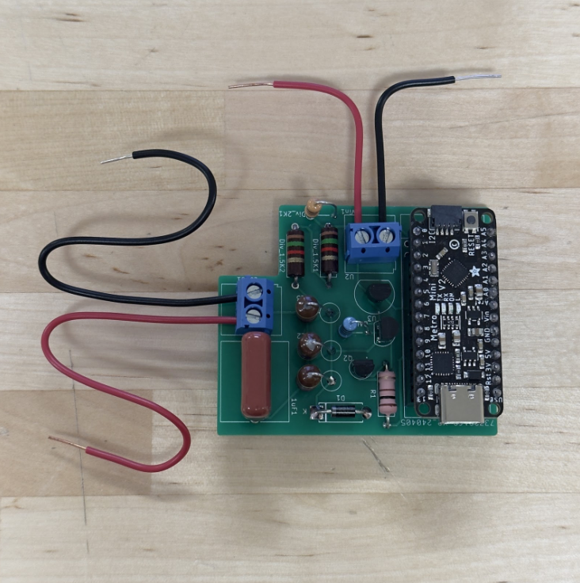

# Solar Powered DC Converter
## Circuits Design Project - EE2185 Project 2
👤 Owen Cook  
👤 Nate Seibold

## Motivation

The goal of the project was to design and build a prototype DC step down converter based on user specifications. The converter needed to run off of a 20V solar panel and be able to supply the user-defined voltage as an output. By nature, the circuit should also be able to adapt the pulse width to prevent solar panel voltage fluctuations from impacting the output. In addition to the previously listed requirements, the circuit should use minimal power and avoid overheating any components.

## Solution

To tackle the problem, the proposed design involves using an Arduino Micro attached to a PCB shield. This design utilizes a buck circuit and Arduino’s built-in PWM generator to cut the 20V output down to the desired output, in this case, 1.2V to power a DC motor. A custom PCB was designed to house the circuit elements, and once assembled, the Arduino fits onto the board to provide a compact and durable form factor. Although not included in the prototype design, the form factor enables easy attachment to a headband or other mounting solution.

The design is relatively inexpensive to produce, as the vast majority of its components cost less than a dollar. The two main expenses come from the shipping of the PCB and Arduino. Both of these costs would be lowered when production levels increased. Supply chain optimization would also aid in lowering costs as most of the PCB cost came from shipping expenses. Below is a brief breakdown of the costs associated with the prototype model, a full budget can be found in Appendix A.

| Item            | Price |
|----------------|-------|
| Arduino Micro  | $10.00|
| PCB+Shipping   | $20.00|
| Circuit Materials | $1.30|

The total price per unit is approximately $31.30, this leaves plenty of room in the budget for a mounting solution. As previously mentioned, these costs would likely continue to lower with more units made.

## Schedule

The timeframe for the project was set at 8 weeks, and the project finished ahead of schedule. Below is the planned timeline.

Most tasks were completed ahead of schedule during the design process. A working circuit was constructed in Week 2, the remaining time in Week 3 was used to diagnose some initial problems related to overheating components. After new component values were chosen, the circuit began to work as expected. PCB design was started during the initial testing weeks, in order to ensure an on-time delivery. The total PCB design and build process took roughly 4 weeks. In between ordering and receiving the PCB, code development took place. A working base code was produced in 1 week, and later weeks would be dedicated to refining the code to increase reaction time and stability. This process was expected to take the longest, but ended up being relatively straightforward. Upon the arrival of the PCB, the week-long final assembly process began and was completed without complications. The following weeks were spent conducting testing and producing reports.

## Results

After the 8 week development period, a working prototype was created that achieves all of the aforementioned goals. The prototype has been run off of a benchtop DC voltage source mimicking 20V from the sun, which worked as expected with no overheating. We then took it outside, connected it to a solar panel, and successfully powered the DC motor. A picture of the assembled prototype can be seen below.

The two screw terminals represent the input voltage and the output voltage. The longer wires are the output and the shorter wires are the input. We picked a pulse width and period so that the input would be let through to the output circuit just long enough to charge it up to the desired output voltage, then the switch was closed. This desired output kept adjusting itself based on the feedback voltage. The desired output can easily be chosen in the code.

## Validation

With the device running off of 20V from the DC power supply, the circuit draws about 0.18 A of current and 3.6 W of power. We tested other input voltages and saw that the power output stays relatively the same, decreasing slightly as the input voltage is decreased. We recorded the power and current draw based on different input voltages below:

| Input Voltage (V) | Current Draw (A) | Power (W) |
|--------------------|-------------------|-----------|
| 20                 | 0.180             | 3.60      |
| 17.5               | 0.187             | 3.27      |
| 15                 | 0.212             | 3.18      |
| 12.5               | 0.245             | 3.06      |
> _Current is estimated as it constantly changes due to PWM adjustments_

As seen above, as we decrease the voltage, the current increases. This is good for output purposes as the DC motor stays spinning as we decrease the input voltage. We found that it was best to keep the input voltage as specified, 20V, to limit the current and ultimately the heat production of the circuit components.

Shown above in yellow is an oscilloscope reading recording the voltage of the PWM from the Arduino, and in green, the output voltage across the load. This was tested with the desired output being 5V and as seen in the image, the output is hovering around 5V. We also measured with a multimeter and got a reading of 5V ±0.01V.

### Cost Breakdown

| Item               | Price |
|--------------------|-------|
| Arduino Micro      | $10.00|
| PCB (unit price at minimum quantity) | $2.00|
| Resistor (x5)      | $0.50 |
| Inductor (x3)      | $0.60 |
| NPN Transistor (2N3904) | $0.40 |
| Voltage Regulator (LM78L05) | $0.58 |
| FET (VP3203N3)     | $1.85 |
| Schottky Diode     | $0.43 |
| Capacitor          | $0.20 |

> The above prices were based on the purchase of one unit unless otherwise noted.
